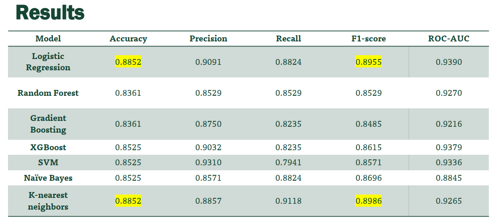

[Home](https://github.com/saifullah-s/portfolio/blob/main/README.md) &nbsp;·&nbsp; [Projects](https://github.com/saifullah-s/portfolio/blob/main/projects.md) &nbsp;·&nbsp; [Skills](https://github.com/saifullah-s/portfolio/blob/main/skills.md) &nbsp;·&nbsp; [About Me](https://github.com/saifullah-s/portfolio/blob/main/about-me.md) &nbsp;·&nbsp; [Contact](https://github.com/saifullah-s/portfolio/blob/main/contact.md) &nbsp;·&nbsp; [Resume](https://github.com/saifullah-s/portfolio/blob/main/resume.md)  

# Heart Attack Prediction Using Machine Learning

- [Project Outline](https://drive.google.com/file/d/1Bi-3Ub-Bb_wH2qBtM545WmrPPl1Ur7AB/view?usp=drive_link)
- [Interactive Colab Notebook](https://colab.research.google.com/drive/1TMU5mRZ7P1GHO_ZR8Ezv_aQNuPJGMqDK?usp=drive_link)
- [Presentation](https://drive.google.com/file/d/1ZaRL2tWgApyy8LGwMS7fLhOC44mY8VUt/view?usp=drive_link)

## Mentor
**Dr. Beibei Cheng**  
Applied Scientist at Microsoft

## Description  
A machine learning project that dives into data exploration and visualization, feature engineering, data preprocessing, machine learning modeling and evaluation, hyperparameter tuning, and interpretability techniques to build robust predictive models. 

### Concepts and Techniques:  
- Supervised Learning (Binary Classification)
- Exploratory Data Analysis (EDA)
- Data Visualization (Pair plots, KDE plots, box plots, and correlation heatmaps)
- Data Processing and Feature Engineering
- Machine Learning modeling (Logistic Regression, Random Forest, and many others)
- Hyperparameter Tuning
- Model Explainability/Interpretability
- Interactive Plots (with Plotly)

### Frameworks and Libraries:  
- Pandas
- Scikit-learn
- SHAP  
- Matplotlib
- Seaborn
- Plotly  

## Objective  
To develop and evaluate machine learning models for predicting the likelihood of a heart attack based on clinical features in the dataset.

## Key Techniques and Skills

### Data Preprocessing
- Categorized features into categorical and continuous groups.
- Applied normalization to continuous features using StandardScaler.
- Encoded categorical features using one-hot encoding with `pandas.get_dummies`.

### Exploratory Data Analysis (EDA)
- Visualized data distribution and relationships (univariate and bivariate analysis) using:
  - Count plots and box plots for categorical features.
  - KDE plots and pair plots for continuous features.
  - Correlation heatmap for feature relationships.

### Model Building and Evaluation
- Built multiple machine learning models:
  - Logistic Regression
  - Random Forest Classifier
  - Gradient Boosting Classifier
  - XGBoost Classifier
  - Support Vector Machine (SVM)
  - Naive Bayes
  - K-Nearest Neighbors
- Evaluated models using metrics:
  - Accuracy, Precision, Recall, F1-score, ROC-AUC
- Plotted ROC curves for model comparison.

### Hyperparameter Tuning
- Optimized hyperparameters for Logistic Regression and KNN using GridSearchCV.
- Identified best parameters for each model and re-evaluated performance.

### Model Interpretability
- Visualized feature importance using SHAP:
  - Explained the Logistic Regression and KNN models.
  - Generated summary plots highlighting feature impact on predictions.
- Critically analyzed the variation in feature importances for the two models.

### Interactive Visualizations
- Used the Plotly library to create various interactive visualizations including: interactive feature correlation heatmap, 3D scatter plot, and others.

## Results
- Models were evaluated for their ability to accurately predict the likelihood of heart attacks:
  - Logistic Regression and KNN achieved the highest balanced performance.
  - ROC-AUC curves provided insights into the trade-offs between sensitivity and specificity.
- Machine learning shows promise as a diagnostic aid.
- The results of the various models are shown below:  

## Visual Highlights
### KDE Plots

- Explored relationships between input features and target feature to understand data trends.

### 3D Scatter Plot

- Visualized `age`, `thalachh`, and `chol` to identify trends related to heart attack likelihood.

## Impact and Takeaways
This project demonstrated the application of machine learning in healthcare analytics, highlighting the importance of data preprocessing, model tuning, and interpretability. The use of SHAP enhanced transparency in model predictions.
